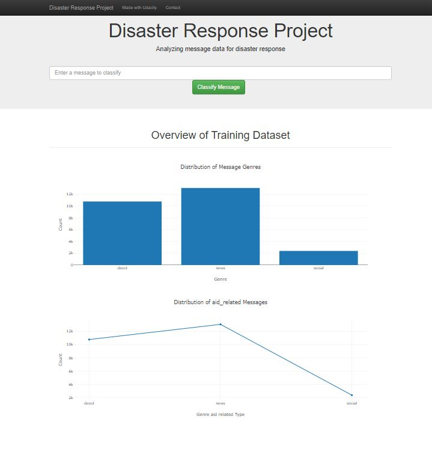
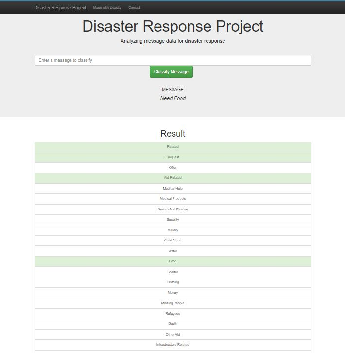

# DISASTER RESPONSE NLP MODEL

## Introduction

The primary aims of disaster response are rescue from immediate danger and stabilization of the physical and emotional condition of survivors. These go hand in hand with the recovery of the dead and the restoration of essential services such as water and power. 

In this Project, we'll work with data set containing real messages that were sent during disaster events. This dataset will help in building a machine learning pipeline to categorize these events so that we can send the messages to an appropriate disaster relief agency.

## Web App Snippet

## Important File Descriptions

* **ETL_Pipeline_Preparation.ipynb:** *Steps Performed in Jupyter notebook to Prepare the Data (Extracts,Transform and Load)
* **ML_Pipeline_Preparation.ipynb:** *Steps Performed in Jupyter notebook to Prepare the ML Pipeline.
* **process_data.py:** *Python File (Present in DisasterResponse_ML/data/ Directory) to run ETL pipeline that cleans data and stores in database
* **train_classifier.py**: *Python File (Present in DisasterResponse_ML/models/ Directory) to run ML pipeline that trains classifier and saves 
* **run.py**: *Python File(Present in DisasterResponse_ML/app/ Directory) to run the Web App 

## Libraries Used
  1. Nltk
  2. Pandas
  3. Scikit-Learn/sklearn
  4. Pickle
  5. re
  6. sqlite3
  7. plotly
  8. JSON
  9. flask

## Steps to Run the Project in Local Directory:
1. Run the below commands in the project's root directory to set up your database and model.
   - *To run ETL pipeline that cleans data and stores in database
      `python data/process_data.py data/disaster_messages.csv data/disaster_categories.csv data/DisasterResponse.db`
   - *To run ML pipeline that trains classifier and saves
       `python models/train_classifier.py data/DisasterResponse.db models/classifier.pkl`
2. Run the following command in the application directory to run your web app.
    `python run.py`
3. Go to http://0.0.0.0:3001/

Note- Assuming python is already set as environment variable 

# Acknowledgements
I would like to give credit to:
* 
* 
* 

## Github Link: https://github.com/ankitparida/DisasterResponse_ML
